 

<h3><code>Jedaias Ismael</code></h3>

<table>
<tr>
<td align="center" valign="middle" width="420">
  
   
  <b><code>エ ン ジ ニ ア</code></b>
   
  <samp>Olá! Eu sou o <b>Jedaías Ismael</b></samp>
   
   
  
   
   
  
   
   
  <samp>
    <b>Analista de Soluções e Dados</b> na <b>NBS TELECOM</b>
     
     
    🎓 Estudante de Ciência da Computação
  </samp>
</td>
<td valign="top"></td>
</tr>
</table>

 
 

 
  
  
  
  
  
  
  
  
  
  
  
  
  
  
  

 
 

  <samp>
    <b>
      Contato
    </b>
  </samp>
   
   

  

